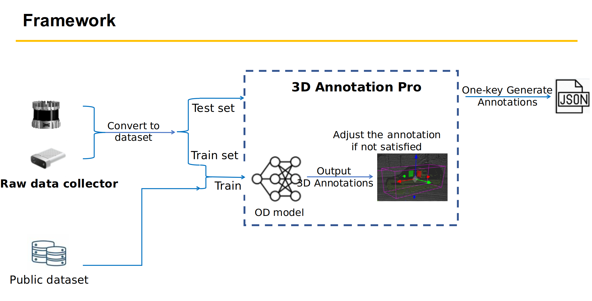

# Autometic 3D annotation (Point Cloud)

## Overview

## Demo

## Features

- Autometic identify annotation 
- 60+ FPS generation speed (on RTX 4060)
- Scalable to upport multiple scene
- Manually edit/create/delete for the unsitisfied annotation
- Point cloud and image self-caliberation
- One-key-click to generate and export annotation file (json)
- SUpport both Linux and Windows platform

## Environment
- PyTorch 2.0.1 + CUDA 12.2
- Windows 11/Ubuntu 22.04

## Implement
- Run: main.py
- visit http://0.0.0.0:8081 in browser

## Acknowledgement
Part of the manual annotation adjustment work is based on [SUSTechPOINTS](https://github.com/naurril/SUSTechPOINTS).

